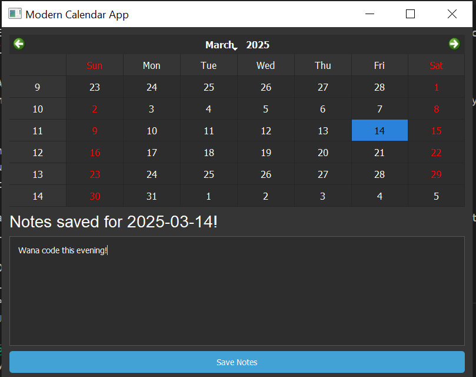
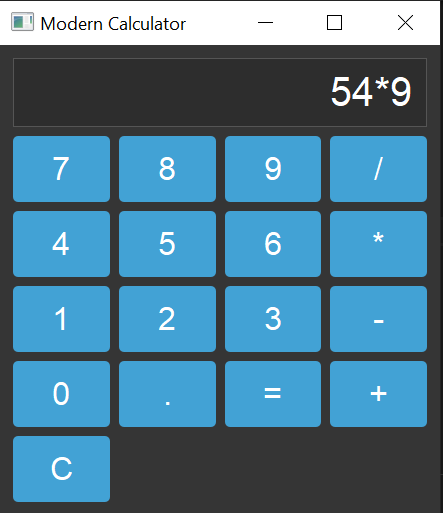
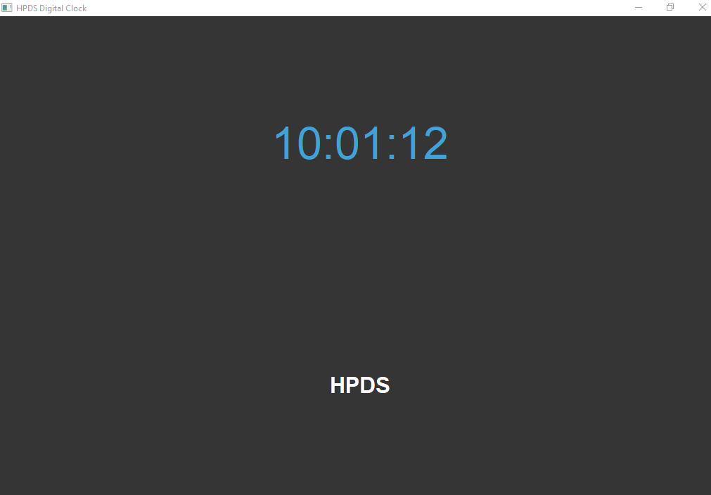

README.md for the three apps: Calendar App, Calculator App, and Digital Clock App. This README provides an overview of the apps, installation instructions, usage, and features.

HPDS Apps Collection
Welcome to the HPDS Apps Collection! This repository contains three simple yet powerful desktop applications built using PyQt5:

>Calendar App
>Calculator App
>Digital Clock App

Each app is designed with a modern and clean user interface, making them both functional and visually appealing.

Apps Overview
1. Calendar App
A modern calendar application that allows users to:
View and select dates.
Add and save notes for specific dates.
Features a sleek dark theme.
**Calendar App Screenshot**

2. Calculator App
A basic calculator application that supports:
Addition, subtraction, multiplication, and division.
Clear functionality to reset the display.
Error handling for invalid expressions.
A modern dark theme with responsive buttons.
**Calculator App Screenshot**

3. Digital Clock App
A stylish digital clock application that:
Displays the current time in hh:mm:ss format.
Features the "HPDS" branding below the clock.
Updates in real-time with a modern dark theme.
**Digital Clock App Screenshot**

Installation
Prerequisites
Python 3.x
PyQt5

**Steps**
Clone the repository:

git clone https://github.com/harrisonokoth/hpds-apps.git
cd hpds-apps
Install the required dependencies:

pip install PyQt5
**Run the apps:**

**Calendar App:**
>python calendar_app.py

**Calculator App:**
>python calculator_app.py

**Digital Clock App:**
>python digital_clock.py

**Features**

**Calendar App**
Interactive calendar widget.
Save notes for specific dates.
Notes are stored in a text file (calendar_notes.txt).
Modern dark theme.

**Calculator App**
Basic arithmetic operations (+, -, *, /).
Clear button to reset the display.
Error handling for invalid expressions.
Responsive and modern design.

**Digital Clock App**
Real-time digital clock.
Displays time in hh:mm:ss format.
"HPDS" branding integrated into the design.
Sleek dark theme.

**Screenshots**

**Contributing**
Contributions are welcome! If you'd like to improve the apps or add new features, feel free to:

Fork the repository.

Create a new branch (git checkout -b feature/YourFeature).

Commit your changes (git commit -m 'Add some feature').

Push to the branch (git push origin feature/YourFeature).

Open a pull request.

**License**
This project is licensed under the MIT License. See the LICENSE file for details.

Acknowledgements
Built with PyQt5.

Inspired by modern UI/UX design principles.